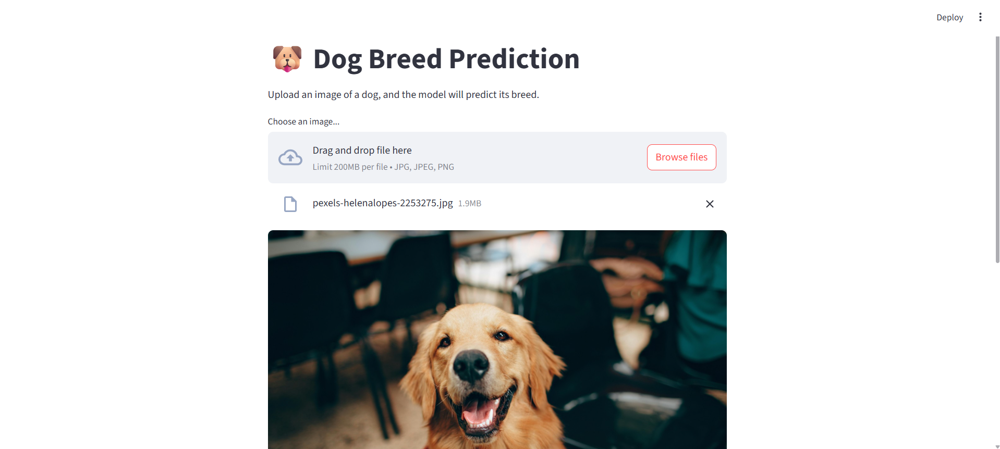
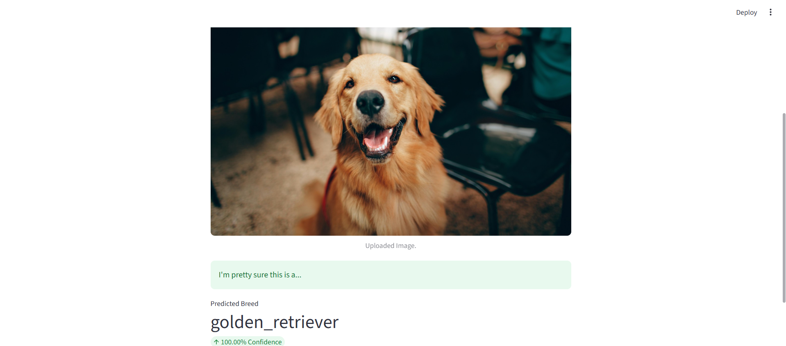

# 🐶 DogClassifier

A simple web application built with **Streamlit** and **TensorFlow/Keras** that classifies dog breeds from an uploaded image. This project leverages a pre-trained MobileNetV2 model fine-tuned on a custom dog-breed dataset.

---

## Screenshots




---

## 🚀 Features

* **Image Upload**: Upload `.jpg`, `.jpeg`, or `.png` images of dogs.
* **Real-time Prediction**: Uses a fine-tuned MobileNetV2 model to predict the breed.
* **Confidence Score**: Displays the model's confidence in the prediction.
* **Interactive UI**: Clean Streamlit interface with metrics and balloons for a fun user experience.

---

## 📁 Project Structure

```bash
DogClassifier/
├── app.py                            # Main Streamlit application
├── unique_breeds.txt                 # List of dog-breed labels (one per line)
├── requirements.txt                  # Required Python packages
├── runtime.txt                       # Runtime environment specification (for deployment)
├── 2025....mobilenetv2_dog_breeds.h5 # Trained Keras model file
├── dog_vision.ipynb                  # Notebook used for data exploration & training
└── README.md                         # Project documentation
```

---

## 🛠️ Prerequisites

* Python 3.10 (preferred) or higher
* pip (Python package installer)

---

## ⚙️ Installation & Setup

1. **Clone the repository**

   ```bash
   git clone https://github.com/Soumyad2003/Dog_Breed_Classifier.git
   cd DogClassifier
   ```

2. **Create and activate a virtual environment** (optional but recommended)

   ```bash
   python -m venv venv
   source venv/bin/activate      # Linux/macOS
   venv\Scripts\activate       # Windows
   ```

3. **Install dependencies**

   ```bash
   pip install -r requirements.txt
   ```

4. **Verify files**

   * Ensure `2025...mobilenetv2_dog_breeds.h5` and `unique_breeds.txt` are present in the project root.

---

## ▶️ Running the App Locally

```bash
streamlit run app.py
```

* The app will open in your default browser at `http://localhost:____`.
* Upload a dog image and see the predicted breed along with confidence score.

---

## 📦 Dependencies

Key packages used:

* `streamlit` — Web app framework
* `tensorflow` — Deep learning library
* `tensorflow_hub` — Reusable model components (for KerasLayer)
* `numpy` — Numerical operations
* `Pillow` — Image processing

---

## 🎓 Model Training (Optional)

1. **Data Preparation**: Gather and preprocess a dataset of labeled dog images.
2. **Notebook**: Open `dog_vision.ipynb` to explore data and training pipeline.
3. **Transfer Learning**: Fine-tune a MobileNetV2 backbone on your custom dataset.
4. **Export**: Save the trained model:

   ```python
   model.save_model("mobilenetv2_dog_breeds.h5")
   ```
5. **Labels**: Export class names to `unique_breeds.txt` (one breed per line).

---

## ☁️ Deployment

You can deploy this Streamlit app on **Streamlit Cloud** or any platform that supports Python:

1. Push your repo to GitHub.
2. Sign in to [Streamlit Cloud](https://streamlit.io/cloud) and link your repo.
3. Add any required secrets or config if needed.
4. Deploy and share the live URL!

---

## 👤 Author

**Soumyadeep Seal**
